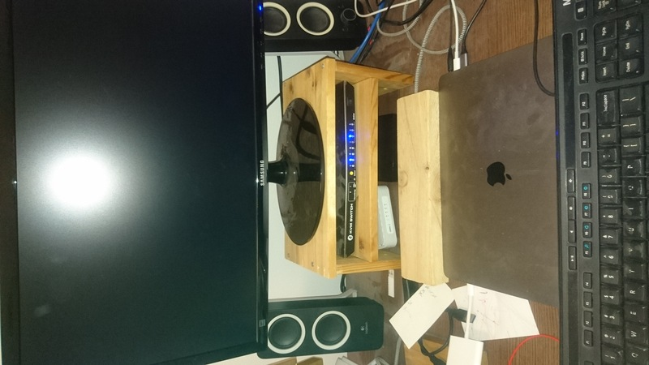
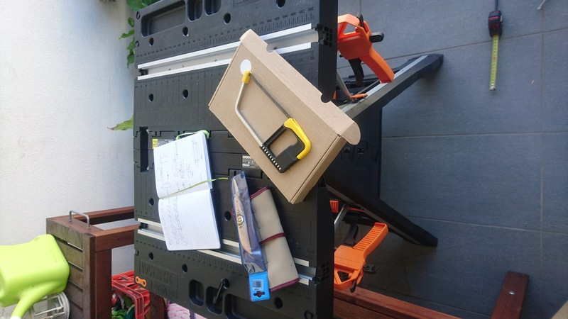
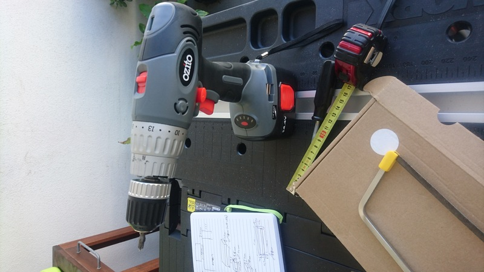
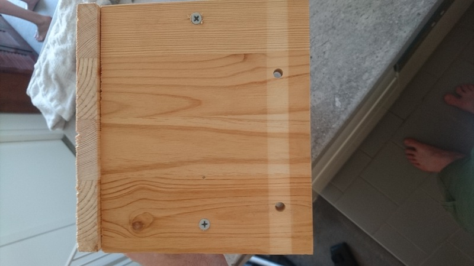
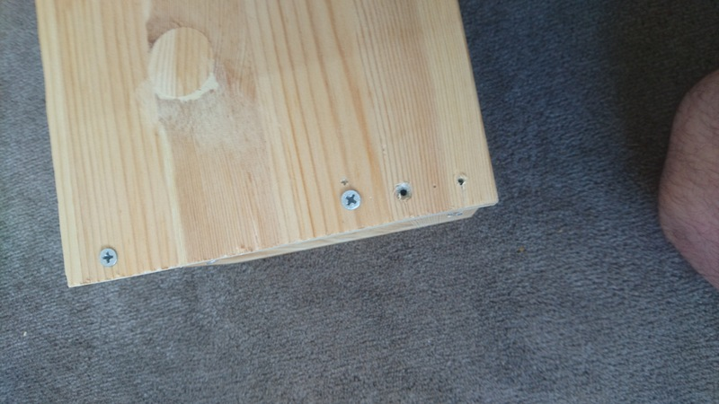

# Screen Raiser

My first wood project made with tools I gathered over time and scrap wood. I wanted to check how hard it could be with
what I had. My conclusion is that if people have a lot of tools, there is a reason for it!

## Details

### Starting date

12th of December 2021

### Finishing date

12th of December 2021

### Goal

I have been working from home for quite some time now, and my current screen height is not adjustable which was not a
problem before as I was using a desktop. But for work, I have been provided a laptop, which I want to keep
under my main screen (the desk is quite small, so I don't want the screens next to each others).
I found a small plastic screen raiser which worked, but was not high enough, thus my laptop screen was hiding the bottom
part of the main screen, which can be an issue when the app bar is on the bottom part of the screen...

So let's raise this screen a bit higher!!!
It's also good to note that I have a number of smaller items which needed to find a home in this setup:

- a tiny computer
- a router
- a KVM

### Pictures

Let's start with the end result (disregard the piece of wood in front and the dust which are not part of the project):

From far, it looks alright, but from closer not that much...
 - the side panels are not perfectly vertical
 - because of which the top panel is not perfectly horizontal
 - the screws have broke a bit the top panel
 - the edges are not smooth
 - the side panels are not perfectly aligned with the side of the top panel
 - the middle panel is actually a bit too short for the KVM...

So yeah, that's a lot of things, but let's be honest, it works, it is stable, and will be solid enough for this task.

Now a bit behind the parts which went wrong.

#### Tools

It should all start by having the right tools, and knowing how to use them well, which I do not.

Two pictures of the tools I used for this project.

You can see the saw. I thought it would be fine because not a big project. Wrong!
The

I had 4 boards from a small shelves I found. They just needed some cutting for this project.
I needed to cut each of them only once, their depth and width were already good.

#### Extra pictures

I got lazy with the text, so just some close-up pictures.

