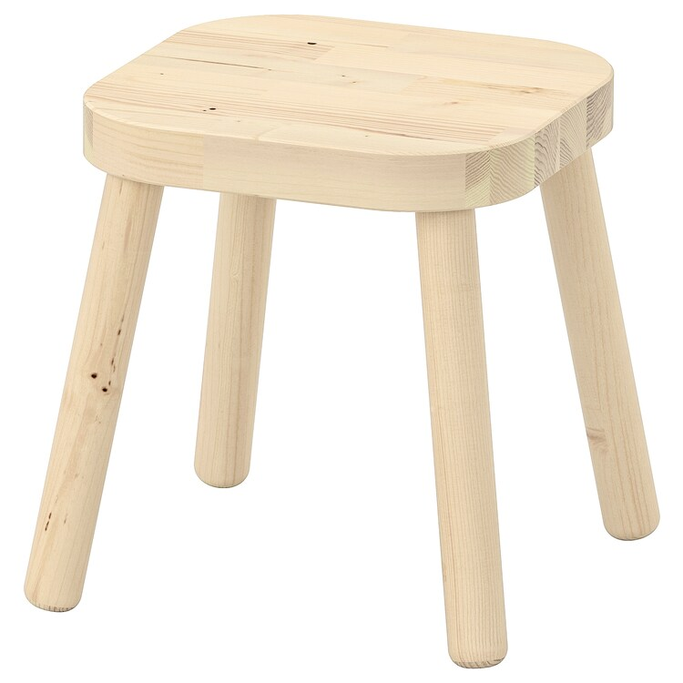
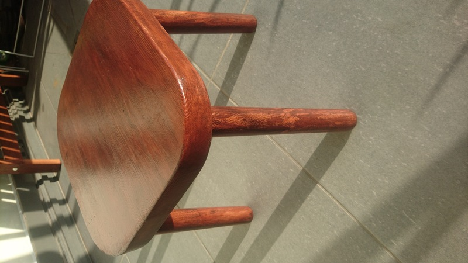

# Stool Renovation

I found a tool which was quite small and seems like fun for Delphine: she could use it for whatever, and we wouln't care if she breakes it.

 becomes 

It was an [IKEA stool](https://www.ikea.com/au/en/p/flisat-childrens-stool-00296780/), well used, coloured, with some random paint marks, the wood was quite marked, and one leg was not well attached. I however forgot to take a picture at the time...

I thus took it as a good project to train my sanding, try  some of my new tools (a rasp and a file) and check how the stain I got is/works.

## Details

### Starting date

Something around Januray 2022

### Finishing date

20th of February 2022

That's long for the actual work which was needed, but the actual work too only a few hours, just spread over a number of weekends/random free times.

## Step 1 - repair the foot

That was the easiest part: the feet are attached to the sit with some metal plate. Each metal plate has 3 screws.
One of this screw had destroyed the wood under it. So just turning the plate and screwing it in place was enough.

## Step 2 - rasping, filing and sanding

The raspis really good, or maybe even too good, I succeeded to rasp my fingers twice already (on another project to come), so I actually mainly used the file on the legs which did not need much material removed. The rasp was however really useful on the sit which needed a lot of material removed.

It was actually fun to do, but I got tired when hand sanding. I don't have much sand paper so I did not want to use too much of it for such a project, so I sanded, it felt good under my fingers, but it's definitely not perfect.

## Step 3 - staining

I gor some free stain so I had no ideas what it would look like. The indications on the can were to put three layers, preferably with sanding in th between, after a few hours.

## Pictures

Happy picture: the end result looks quite good :)

But from closer, there are some deffects:

- when staining, it was a bit dark so I could not see when the brush let some hair 
- the wood is quite cheap, and easy to chip 
- I may have put too much stain, which dropped a bit and overstained... but I also find it pretty, it gives character 
- and also some stain drops on the legs 
- just showing that my sanding could have been better, we can still see some file marks 
