# Boat Carving

I simply wanted to do a small toy boat for Delphine, just for the fun of it: nothing fancy, just a toy for the bath.
I found a [Youtube video](https://www.youtube.com/watch?v=cXwZIn6q-hA) which seemed simple enough, so decided to follow the same kind of pattern.

The end result being:

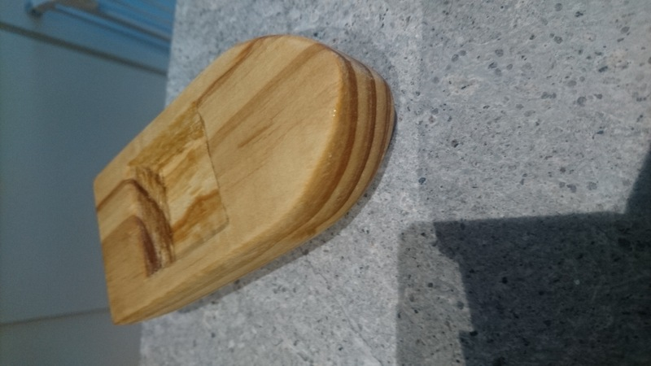

And that floats really well:

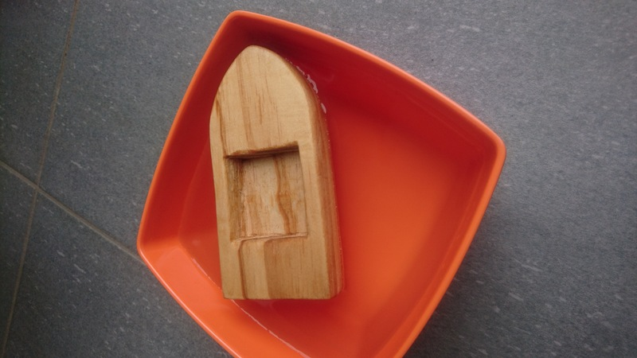

## Details

### Starting date

I don't remember precisely... It took me some times and I totally forgot to take early pictures.
But it was my first project for which I had my hand saw, so probably early February.

### Finishing date

17th of March 2022

At least I have the pictures to prove that it was finished :)

## Step 1 - chop

I forgot to take pictures, but in a nutshell, I have a piece of wood similar to one in the following pictures, draw on it something which roughly had the shape of a boat, and start sawing. Note that at the time, I did not have gloves.

## Step 2 - chiseling to remove big amount

At the same time as the saw, I got some chisels which I want to try. I actually really like using a big chisel to remove big amount of wood, which was way more efficient to remove big quantity of wood than using my carving knife.

## Step 3 - shaping with rasp and file

After having my piece of wood in a really rough shape, I used the rasp to make smoother angles. At the time, I wasn't sure how to proceed as clamping the piece of wood was not really practicle: I had to move a lot all the time. So I tried without clamping: the wood in my hand, the rasp in the other. That was not a great idea: I rasped my finger twice... Don't worry, I won't share pictures (which I do not have in all cases), but it was not the smartest thing to do, which is also why I bought gloves after that.

During this project, I found a better solution: I'm clamping the tool, which allow me to move freely the wood on the rasp, allowing me to make nice and smooth shapes without risk for my fingers.

## Step 4 - open a space in the boat

I originally wanted to copy the video mentioned earlier, i.e. having a big opening with a kind of banch in the middle. But it was taking me forever to do such opening and dig not that deep, so got lazy and just had one opening.
I used a chisel to do it. Making the opening was actually quite hard, and I'm still not sure how to make the inside smooth... I would maybe need specific tools but I don't want to buy too many tools right now. The one I have now should be usable for a large amount of projects, while I'm still learning and maybe finding what will interest me most.

## Step 5 - sanding

Nothing fancy there, just some sanding with sandpaper.

## Step 6 - protecting the wood

The coating I used for the [stool removation](../p2-stool-reno/stool-reno.md) is not made for water (it is water resistant though). And as I wanted to make the toy for Delphine, I also wanted something which would not be dangerous for her if she put it in her mouth. It took me some time, but I bought some food safe wood protector, just giving a slight shine (without stain). The result is quite pretty (at least in my opinion :) ).

## Extra Pictures

Floating:

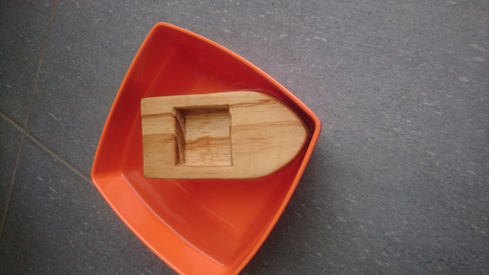
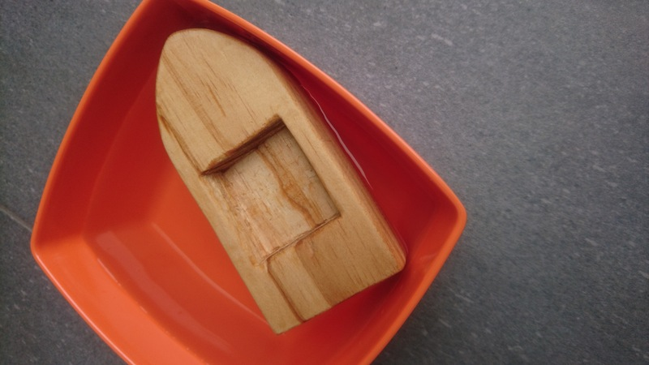

Plenty of different angles

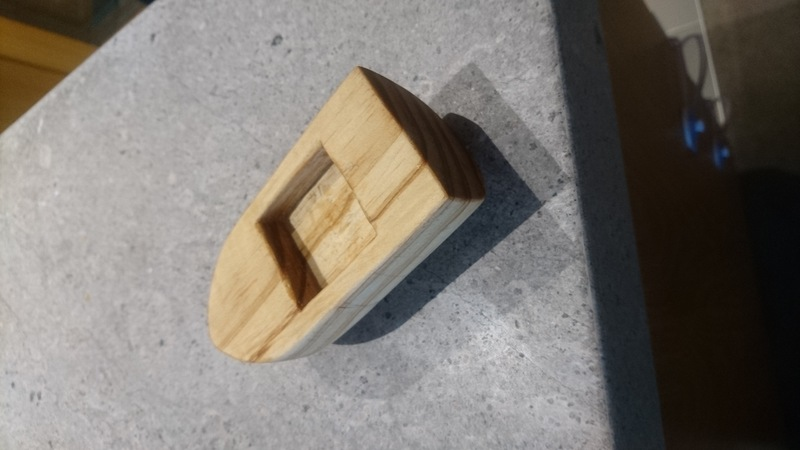
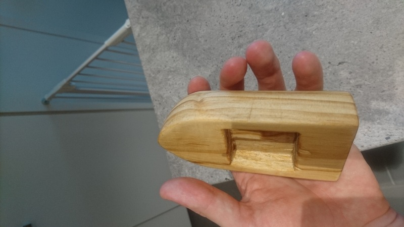
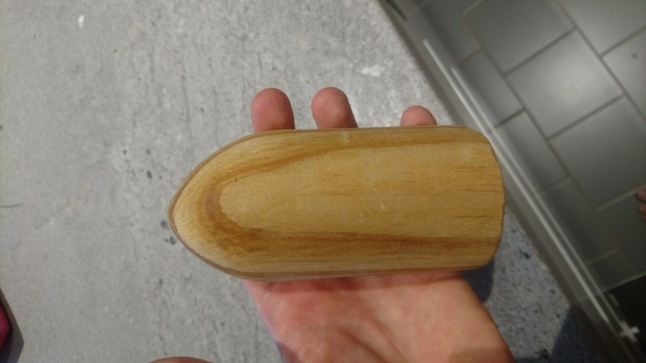
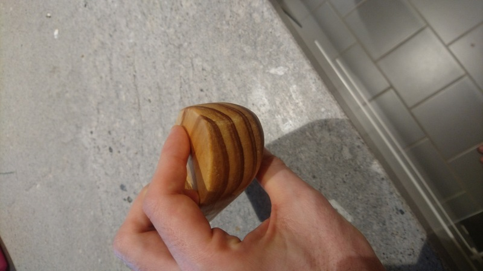

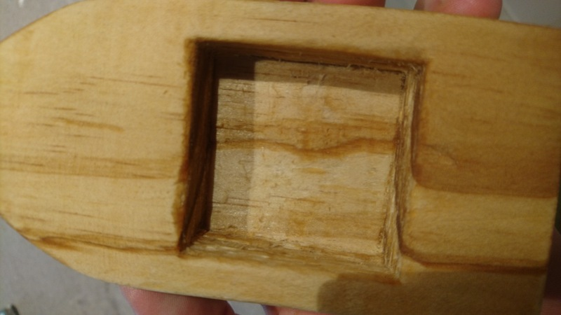
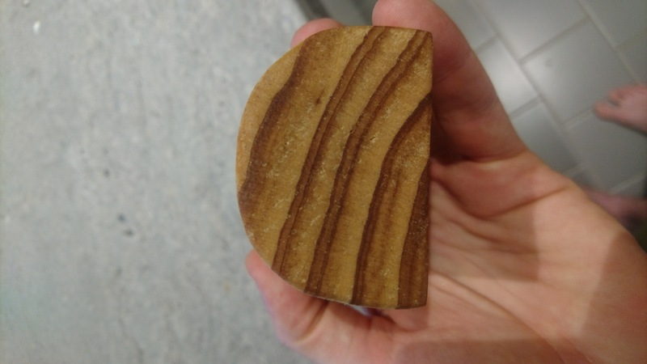

Some closeup where we can see some deffects:

- the wood is a bit porous and the rasp went deep 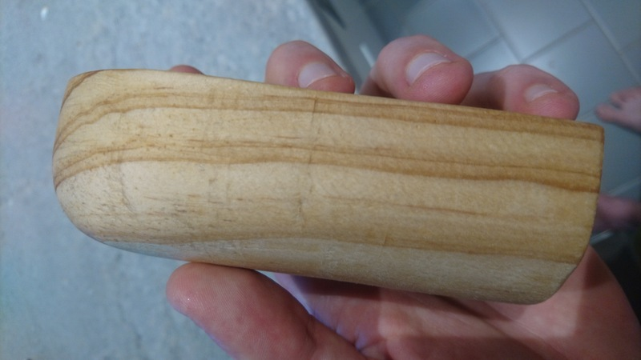
- the inside cavity is not that smooth 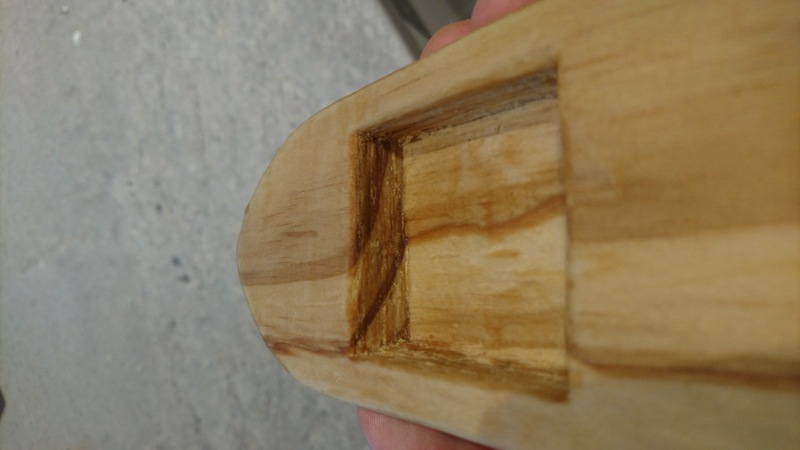
