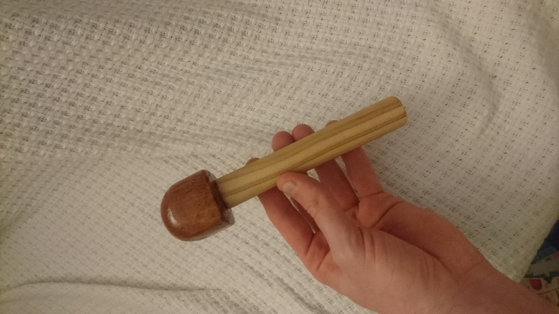
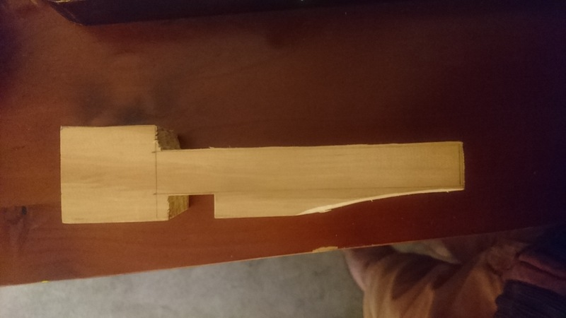
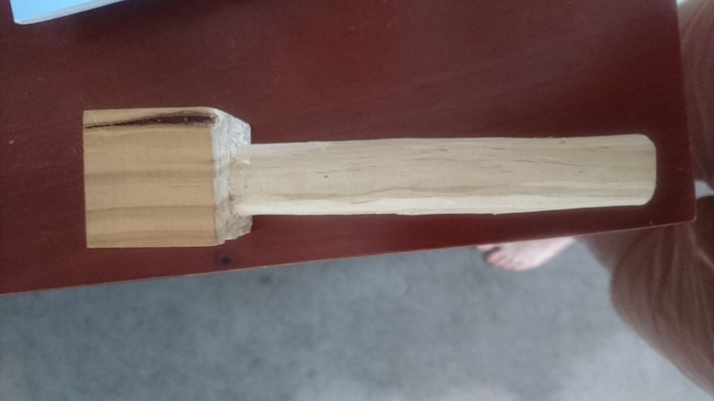
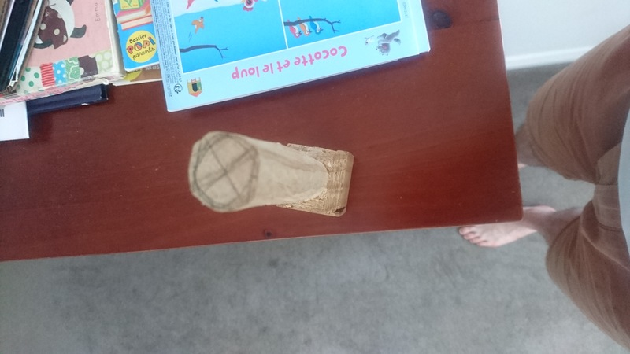
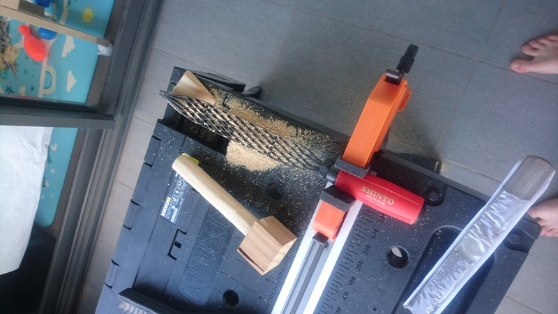
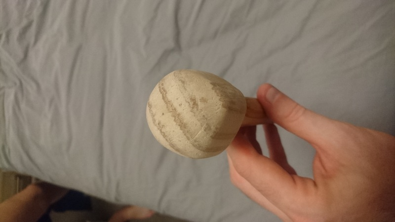
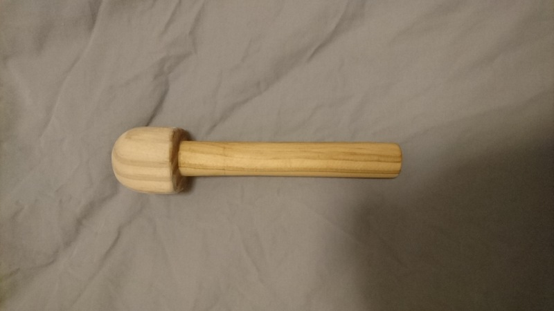
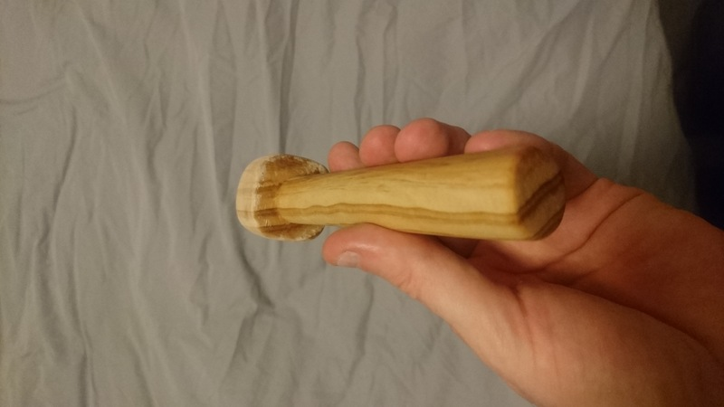
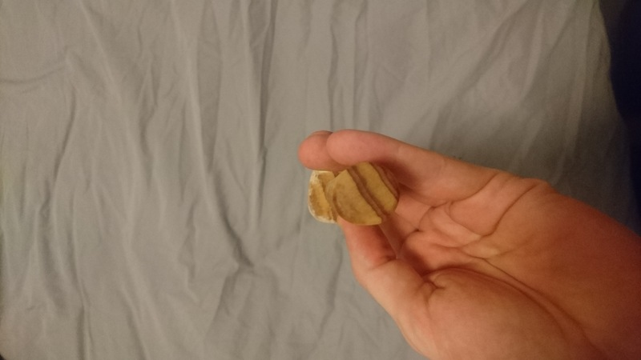
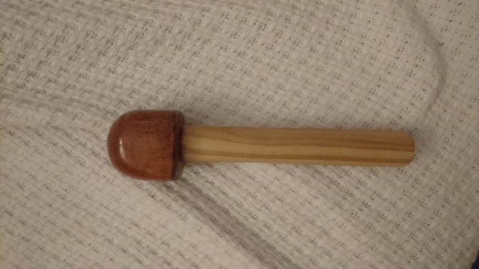

# Castle Logix Piece

Another day, another treasure in the recycling room in our building. This time, it was in a shape of a puzzle game named [Castle Logix](https://www.smartgames.eu/uk/one-player-games/castle-logix). But one piece was missing. You can now guess what the project will be: building the missing piece.

Roughly, it should be a cylinder, with a top on it, with a specific length and diameter.

Let's start with end result:

Yes, it is not a one to one, shaped as the original game, etc. But I did not want to buy new paints, and I also wanted to finish a bit faster.

Note also that I could have made two pieces, glueing them together, but I decided to try to do it in one go, a bit more of a challenge (or maybe a different one, as I'm sure doing a whole of the perfet size to glue would also have been challenging).

## Details

### Starting date

### Finishing date

## Step 1 - chop

Starting point:

While I feel equiped with a proper handsaw, it's not the easiest to use with tiny pieces to cut in length. So I removed a fair bit but I could have probably been able to do more withe the saw.

## Step 2 - chiseling for shaping

Still time to remove big pieces of wood relatively fast, so I used the chisel.

And finally shaping the core to something which more looks like a cylinder:

## Step 3 - rasping

I'm starting to get the gist of the rasp small things and a good setup:

I rasped the cylinder to look like a cylinder, and the top to have a nicer rounder shape.

## Step 4 - sanding

No pictures, and quite self-explanatory, and brining it down to something which quite look like a cylinder (even if not perfect, it's hard with just hand tools).

What the top looks like after all that:

## Step 5 - coating cylinder

The coating was done in two steps: first the cylinder, then the top in different types of coating.

I used the same coat for the cylinder as the one I used for the [boat](../p3-boat/boat.md):

## Step 6 - coating top

And finally the top coated using the same stain as the [stool](../p2-stool-reno/stool-reno.md):

## End result

Just another picture of the end result:

## Extra Pictures

Just a picture of a really visible deffect: the top stain has been overstained at one point: I was keeping the piece top down to dry, and thus the drops were accumulating at the top of the top, overstaining it. I did not sand it down as it would have been long, and I find it OK :)

