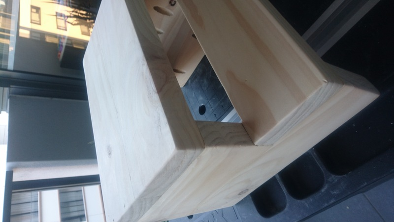
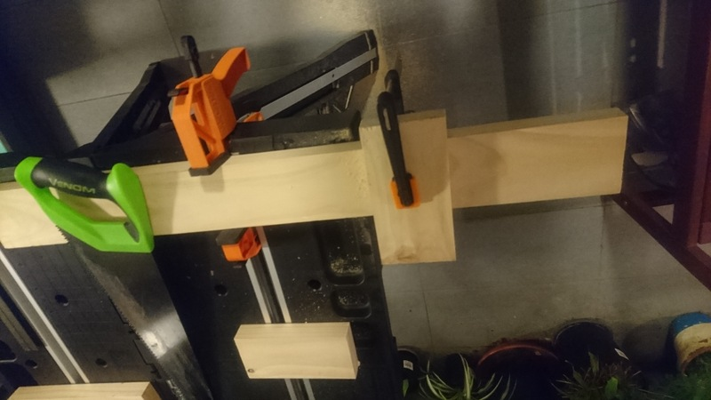
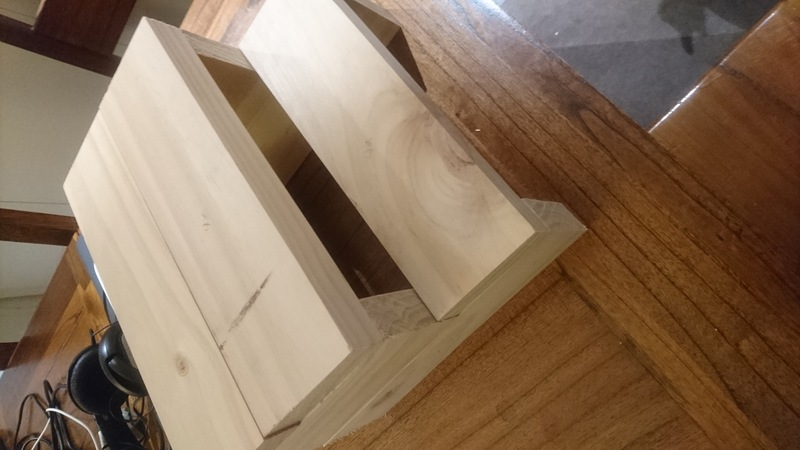
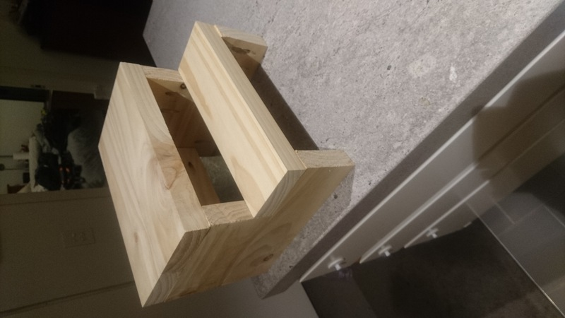
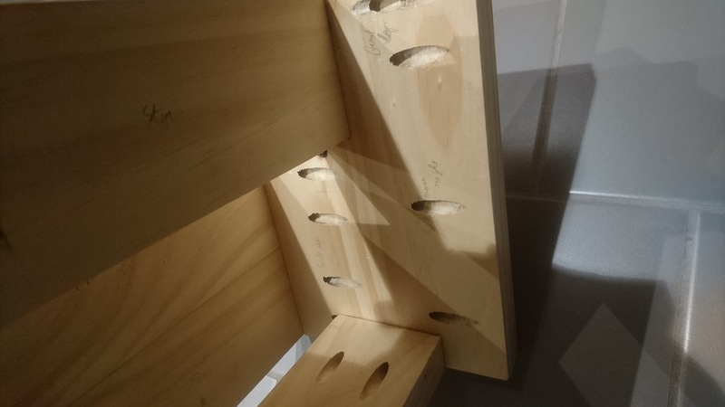
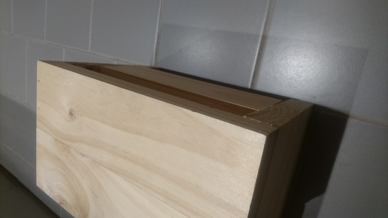
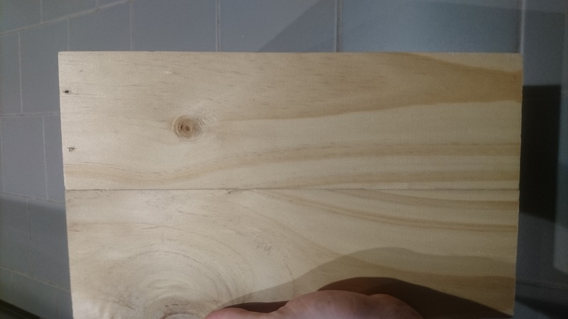
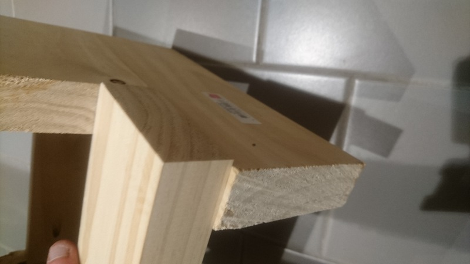
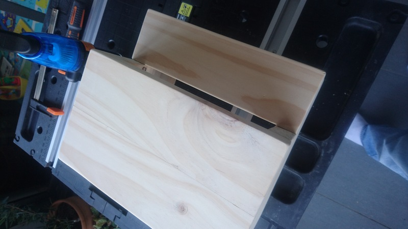
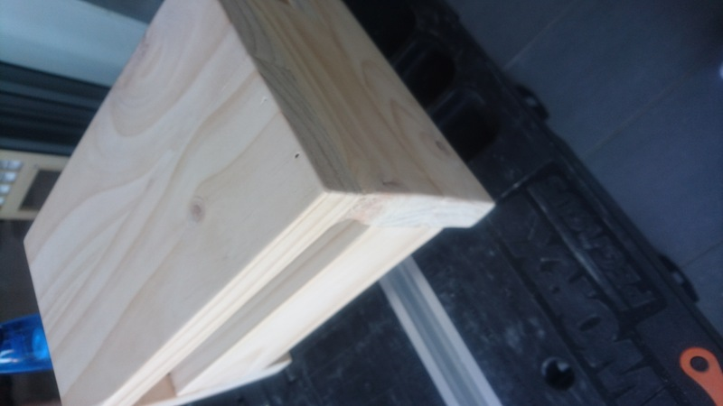

# Small Steps

Delphine is growing, but still a bit short for a number of things. So we wanted to give her a boost, helping her to access a sink with some small steps.

So let's do it!

The end result (with a bad angle because it's not a photography blog):

I found a quite simple plan on [motelikehome.net](https://www.morelikehome.net/2012/10/day-27-build-simple-step-stool.html) which some people also did in a [Youtube video](https://www.youtube.com/watch?v=P6aWZMVl-Ig).

## Details

### Starting date

28 May 2022

### Finishing date

13 June 2022 - quite fast for me :)

## Step 1 - getting the wood and chopping

Damn, I did not realise how many wood sizes there were... and who knew that wood size is also not overly standard between countries, because of measure systems...
But after spending way too long at the shop, I got something close enough to what I was searching for,and let the chop began :)

All went well, and from a 2m poll, got 8 pieces at the good length.

At the result should look like (all put up but without the screws in):

## Step 2 - pocket screwing the steps

The pocket hole jig is really nice to use when used well. Really easy, and attach stuff well. Don't worry, it is not a promotised blog.

The result when done looks like:

And that's a lot of screws:

The back:

But I made a the few mistakes:

### Mistake 1: wrong screws

The screws I first tried were too long (I'm still not sure if I don't know how to read the blog I used, but I should have read the jig manual first instead. of just the plan)... long story short, it went through the board, but that's one good thing with pocket hole, and it's easy to remove them without much impact.

### Mistake 2: hole placements

You can (maybe) see that the two sides are not symmetrical, and that at the top right I made a hole in both directions, but I was lucky that none of that impacted the project (thanks pocket holes projects).

What I learn from this: plan before doing, and think only of what you are doing instead of planning the next steps *while* doing things.

### Mistake 3 - slight misplacement

Not muct to say there, the angles did not go fully perfectly, but it is not a massive mistake, and no problem in utility.

## Step 3 - sanding

Sanding makes it look pretty, and I also removed all the sharp angles, also trying to smooth some of the misalignments. The end result is quite good:

